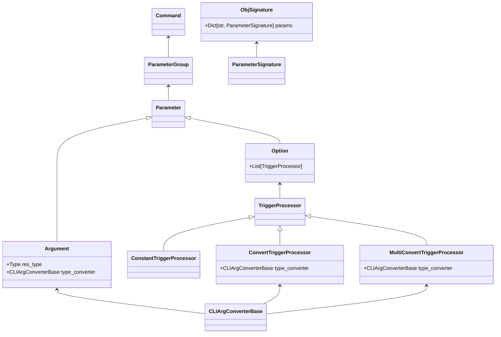

# The class system

In this diagram the relationships between the most important classes are
listed. Depending on where the customization is needed, it is possible 
to manipulate the automatic creation of the CLI at various places, which
is enabled through the event callback system.

# The callback systems for events

During creation of the CLI, at several places in the code callbacks
are being executed that are associated with certain events.

The currently supported events are:

- *START_ARGS_PRE_PROCESS*: This event is being called after the first command
  object is created, but before any input arguments have yet been processed. This
  event can be used to, e.g., globally react to certain options
  that can occur anywhere among the input arguments
- *SIG_EXTRACT*: This is being called after the object signature is extracted for
  an object (e.g. class or function) but before this object is parsed into a 
  _ParameterGroup_ or _Command_. This can be useful when the default annotation 
  of a function causes errors. Also, all information extracted from an obj
  flows through this event, so any adjustments to documentation can be done here.
- *PG_POST_CREATE*: Called after a _ParameterGroup_ was created from the object
  signature. This is done for commands as well as nested classes that are parameters
  themselves.
- *CMD_POST_CREATE*: Called after a _Command_ was created, but before
  any input arguments are processed. 
- *CMD_POST_PROCESS*: Called for _Command_ after the input arguments are 
  processed but before the subcommands are being called.

Using these events, a lot of customization is possible. In addition, 
custom callbacks at the CLI level can be registered.

For convenience it is also easy to specify that these events are only used
for certain objects. Examples on how to use this feature can be found below.

