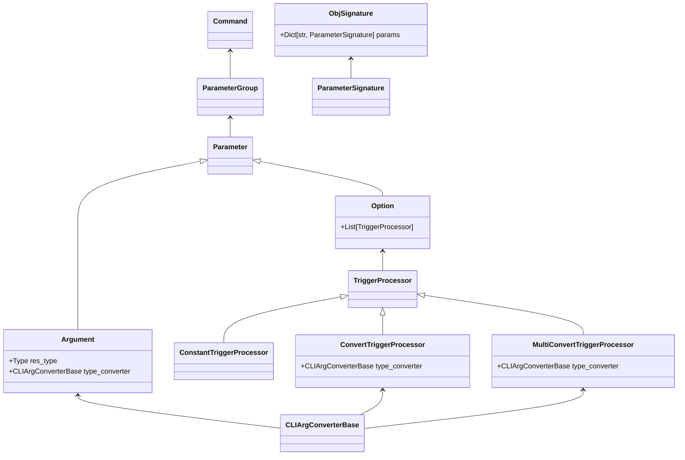

# Welcome to Thermite, a CLI generator

What are the main things that this package provides.

- run any python function or class that has type annotations
- Use docstrings as the source of help
- not require changing the signature of existing functions to customize
- allow for classes as parameter annotations in functions that will be translated
  into grouped options
- Allow for custom classes to be used as type annotations.
- provides the possibility to change the defaults in the CLI by using 
  YAML or JSON definitions (an easy way to use configuration files with CLIs)
- provides a plugin-interface to extend functionality (e.g. the help itself
  is just a plugin)


## Installation

The package is available on pip, so can be installed with 

```bash
pip install thermite
```

## Getting started


For any function, class or instance, just use 

```python
from thermite import run

if __name__ == "__main__":
    run(obj)
```
and the package does the rest.

## Customization options

The package allows plenty of different customization options, enabled 
through the plugin system.

### The class system


In this diagram the relationships between the most important classes are
listed. Depending on where the customization is needed, it is possible 
to manipulate the automatic creation of the CLI at various places, which
is enabled through the event callback system.

### The callback systems for events

During creation of the CLI, at several places in the code callbacks
are being executed that are associated with certain events.

The currently supported events are:

- *START_ARGS_PRE_PROCESS*: This event is being called after the first command
  object is created, but before any input arguments have yet been processed. This
  event can be used to, e.g., globally react to certain options
  that can occur anywhere among the input arguments
- *SIG_EXTRACT*: This is being called after the object signature is extracted for
  an object (e.g. class or function) but before this object is parsed into a 
  _ParameterGroup_ or _Command_. This can be useful when the default annotation 
  of a function causes errors. Also, all information extracted from an obj
  flows through this event, so any adjustments to documentation can be done here.
- *PG_POST_CREATE*: Called after a _ParameterGroup_ was created from the object
  signature. This is done for commands as well as nested classes that are parameters
  themselves.
- *CMD_POST_CREATE*: Called after a _Command_ was created, but before
  any input arguments are processed. 
- *CMD_POST_PROCESS*: Called for _Command_ after the input arguments are 
  processed but before the subcommands are being called.

Using these events, a lot of customization is possible. In addition, 
custom callbacks at the CLI level can be registered.

For convenience it is also easy to specify that these events are only used
for certain objects. Examples on how to use this feature can be found below.

### Callbacks at the CLI level 

Callbacks at the CLI level are used to customize behavior based on user
input that is not directly related to the object for which the CLI is being created.
Typical use cases for this are:

- Showing the help for the current command
- Customizing default values based on JSON or YAML input files
- Creating shell-completion
- A 'no-op' callback, that does nothing but is useful to work as an input 
  delimiter for variable lengh options or arguments

In fact, all of these provided in this library (including the help itself) is
written only using public interfaces. So if you don't like the look of the current
help - you can just write your own :).

These callbacks can be specified to either work for the top-level command and
all subcommands or only for the top-level command. Using the event-system above
it is of course also possible to specify callbacks that only work for specific 
subcommands.

## Examples of common customizations

For various examples on how to customize the CLI, please see the Table of Contents
on the side.


### Transferring parameters between functions

Show a generic wrapper class, for using a function that works for
a single 'file' to adapt it to work on directories of files,
using automatically the information on options from the original file

??? Example "Transferring paramters from one function to another"

    === "Code" 
        ```python 
        --8<-- 'examples/adv/param_transfer.py'
        ```

    === "Help" 
        ```txt 
        --8<-- 'examples/adv/param_transfer_help.out'
        ```

    === "Output"
        ```txt 
        --8<-- 'examples/adv/param_transfer_output.out'
        ```
### Using JSON configuration files

We can also use a YAML or JSON file to dynamically set the defaults 
of the CLI. This can be useful for complex data science projects in order 
not to have to hardcode defaults. 


??? Example "Setting defaults using a config file"

    === "Code" 
        ```python 
        --8<-- 'examples/adv/config_file.py'
        ```

    === "Help" 
        ```txt 
        --8<-- 'examples/adv/config_file_help.out'
        ```

    === "Config file"
        ```txt 
        --8<-- 'examples/adv/config_file.yml'
        ```

While not available yet, in a very similar way plugins can be created that use 
environment variables this way as well.


### Bash completion

Not yet implemented. Plan is to have a JSON specification of the core
of the commands. This will then be run by bash using only minimal dependencies
so that loading the completion is fast, even if the CLI underneath can be slow
due to heavy dependencies (e.g. pytorch).

# Other CLI generators

There are already lots of CLI generators for python, many with lots of 
usage and great functionality that have inspired this package. Check them out.

- argparse
- click
- typer
- fire
- docopt
